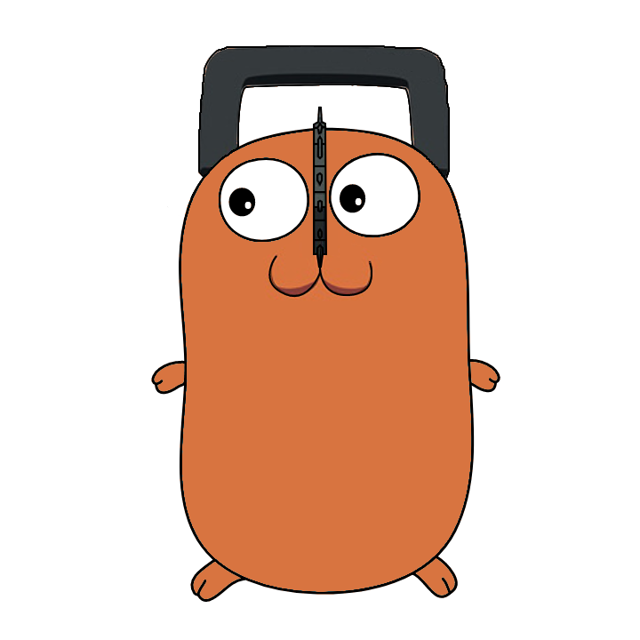

# Gochita

<p align="center">
  
</p>

Gochita is a Discord bot for notifying you of the latest published anime series/movies, headlines, and manga chapters on your dedicated Discord channel.

Gochita stores the RSS feeds into a CassandraDB. The data will be used to figure out recent shows, headlines, and manga chapters that need to be notified to a discord channel and mark them once they are notified.

Currently, Gochita consists of two binaries. The first one is the RSS feed reader to renew fresh shows and headlines. The second one is the Discord bot client.

## Configuration

Make a configuration file at files/config.json

Example configuration file
```JSON
{
  "bot": {
    "token": ""
  },
  "db": {
    "keyspaceName": "",
    "clusters": ["127.0.0.1:9042"]
  },
  "liveChart": {
    "baseUrl": "https://www.livechart.me",
    "uriLatestEpisodes": "/feeds/episodes",
    "uriLatestHeadlines": "/feeds/headlines"
  },
  "reddit": {
    "baseUrl": "https://www.reddit.com",
	  "uriLatestMangaPosts": "/r/manga/new/.rss"
  },
  "time": {
    "timezone": "Asia/Jakarta",
    "defaultTimeout": 1, // in seconds
    "notifyTimeout": 5, // in seconds
    "setCommandsTimeout": 10, // in seconds
    "notifyShowsInterval": 5, // in minutes
    "notfiyHeadlinesInterval": 10, // in minutes
    "notifyMangasInterval": 5, // in minutes
    "addShowsInterval": 60, // in seconds
    "addHeadlinesInterval": 60, // in seconds
    "addMangasInterval": 60 // in seconds
  }
}
```

## Installation

To migrate database, run this
```bash
make migrate-up db="cassandra://localhost:9042/example"
```

To use the livechart data grabber, run this
```bash
make build-livechart && make run-livechart
```

To turn on the discord bot, run this
```bash
make build-bot && make run-bot
```

## Commands

/show list - To show channel's subscribed show

/show subscribe new - To subscribe new shows to a channel

/show unsubscribe new - To unsubscribe new shows to a channel

/show subscribe one query:<show title> - To subscribe a show to a channel

/show unsubscribe one query:<show title> - To unsubscribe a show to a channel

/headline subscribe new - To subscribe new headlines to a channel

/headline unsubscribe new - To unsubscribe new headlines to a channel

/manga subscribe new - To subscribe new manga posts to a channel

/manga unsubscribe new - To unsubscribe new manga posts to a channel

# Roadmap

- Notify new manga update

## Contributing
```
Pull requests are welcome. For major changes, please open an issue first to discuss what you would like to change.
